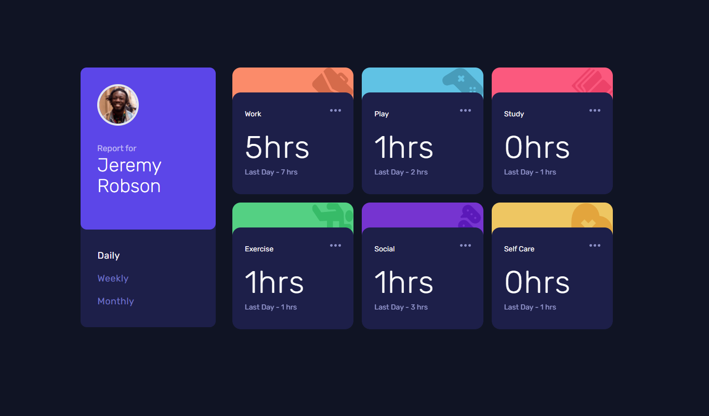

# Frontend Mentor - Time tracking dashboard solution

This is a solution to the [Time tracking dashboard challenge on Frontend Mentor](https://www.frontendmentor.io/challenges/time-tracking-dashboard-UIQ7167Jw). Frontend Mentor challenges help you improve your coding skills by building realistic projects.

## Table of contents

-   [Overview](#overview)
    -   [The challenge](#the-challenge)
    -   [Screenshot](#screenshot)
    -   [Links](#links)
-   [My process](#my-process)
    -   [Built with](#built-with)
-   [Author](#author)

## Overview

### The challenge

Users should be able to:

-   View the optimal layout for the site depending on their device's screen size
-   See hover states for all interactive elements on the page
-   Switch between viewing Daily, Weekly, and Monthly stats

### Screenshot

### Links

-   Solution URL: [Add solution URL here](https://your-solution-url.com)
-   Live Site URL: [https://time-tracking-dashboard-vert.vercel.app/](https://time-tracking-dashboard-vert.vercel.app/)

## My process

### Built with

-   [Tailwind CSS](https://tailwindcss.com/) - CSS framework
-   [Next.js](https://nextjs.org/) - React framework
-   Flexbox
-   CSS Grid
-   Mobile-first workflow

## Author

-   github - [Rhythm Saha](https://github.com/rhythmsaha)
-   Frontend Mentor - [@rhythmsaha](https://www.frontendmentor.io/profile/rhythmsaha)
-   Twitter - [@yourusername](https://www.twitter.com/yourusername)
